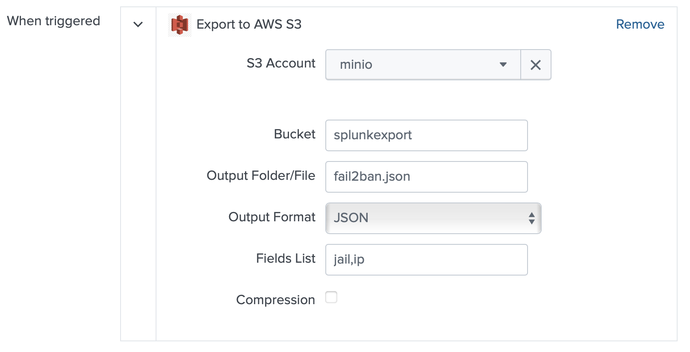

# Running a single page app using Splunk and S3

Requirements:

- Something vaguely S3-like.
- The [Export Everything](https://splunkbase.splunk.com/app/5738) app.
- Splunk
- jQuery

## What the data looks like

In this example I'm just using the data from my regular fail2ban export:

```json
[
    {"ip": "1.2.3.4", "jail": "sshd"},
    {"ip": "5.6.7.8", "jail": "http"}
]
```

There's a list of them, one per IP address.

## The page

It's intentionally very simple, basically load [jQuery from a CDN](https://jquery.com/download/), then load the JSON file and show it. You could include very complex datasets, styling and all sorts of interaction, but I'm not that fancy :)

## Getting the data

I have an alert in my Splunk instance which looks at the fail2ban logs and runs periodically.

```spl
sourcetype=fail2ban NOT CASE(Found) TERM(Ban) 
    ``` drop the fail2ban-importer stuff ```
    NOT TERM(fail2ban-importer) 
| rename src as ip, service as jail 
| stats values(host) as host, count by ip, jail 
| eval host=mvjoin(host,",") 
| fillnull value="ban" status
| lookup fail2ban_allowlist allowlist as ip 
| where NOT status="allow"
| stats values(host) as host, count by ip, jail
```

Because it's all the rage, let's get ChatGPT to explain the query:

> This Splunk SPL query searches the sourcetype "fail2ban" for events that contain the term "Ban" but do not contain the word "Found". It then renames the source field as "ip" and service field as "jail". The query then finds the unique values of the host field and counts them, then sets any null values to "ban" and sets a status field. A lookup is then performed on the "fail2ban_allowlist" table for values that match the ip field. Any results with a status of "allow" are excluded and the query returns a count of unique values of the host field grouped by ip and jail.

tl;dr find the banned things and allow-list my "known good" IPs when I'm doing a dumb.

The alert action is through the Export Everything app to write the data to my Minio instance:


